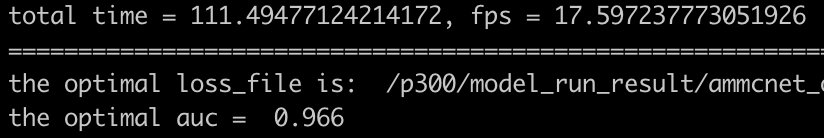
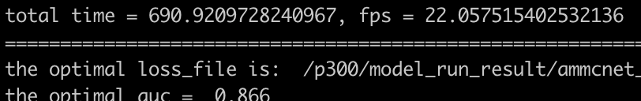
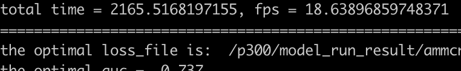

# Appearance-Motion Memory Consistency Network for Video Anomaly Detection
This repo is the official open source of Appearance-Motion Memory Consistency Network for Video Anomaly Detection
, AAAI 2021 by Ruichu Cai, Hao Zhang, Wen Liu,  Shenghua Gao,  Zhifeng Hao.  If you have any questions about our work, please contact me via the following email: njuhaozhang@gmail.com. (Note: Since I am very busy on weekdays, I will reply emails on weekends and hope to get your understanding. Thank you!)

### 1. Installation
```
conda env create -f /your_path_to/environment.yaml
```

### 2. Download datasets
Please manually download all datasets from avenue.tar.gz and shanghaitech.tar.gz and tar each tar.gz file, and move them in to data folder.
You can also download data from https://drive.google.com/drive/folders/1gvO-gZO0sf6PrFcox-2lk70xfH7Uzonf?usp=sharing. (We will upload all datasets as soon as possible...)

```
1. avenue/ped2/shanghaitech
2. the optical flow of above datasets
```

### 3. Inference the pretrain model
#### 3.1 Configure some parameters
```
(1) Code/main/params/const_params.py 
root_dir = "/your_path_to/ammcnet_os" 
dataset_dir = "your_root_path_dataset"
data_dir_gt = "your_root_path_dataset"
flow_model_path = "your_path"
cur_goal_tmp = "/your_path_to/ammcnet_os/log"

(2). Code/main/eval_metric.py 
DATA_DIR = "your_dataset_root_dir" (same as dataset_dir)
```
#### 3.2 Inference
```
# ped2
python -m Code.main.run_test \
--gpu 0 \
--dataset_name ped2 

# avenue
python -m Code.main.run_test \
--gpu 0 \
--dataset_name avenue 

# shanghaitech
python -m Code.main.run_test \
--gpu 0 \
--dataset_name shanghaitech

```
#### 3.3 auc_result







### 4 training
#### shell scripts
```
# avenue
python -m Code.main.run_train  \
--node xxx \
--gpu xxx \
--batch_size xxx \
--num_workers xxx \
--mode training \
--exp_tag xxx \
--helper_tag xxx \
--net_tag xxx \
--loss_tag xxx \
--data_type xxx \
--dataset_name avenue
```
for more details, please refer to the shell script in Code/main/scripts/training_com.sh

#### Training strategies
> Considering that it is not easy to optimize the whole model
directly, and it is easy to get a trivial solution, this paper
proposes a two-stage optimization method consist of pretraining and joint-training. Firstly, we optimized the encoder, decoder, and memory module based on image prediction loss in pixel space and commit Loss in the latent
space. Based on the per-trained model, we use the same loss
function to focus on training the appearance-motion feature
Transfer module(AMFT) and fine-tune the previous module.
Next, we first introduce the details of the per-train stage, then
how to optimize whole model and detect an anomalous case
finally.


